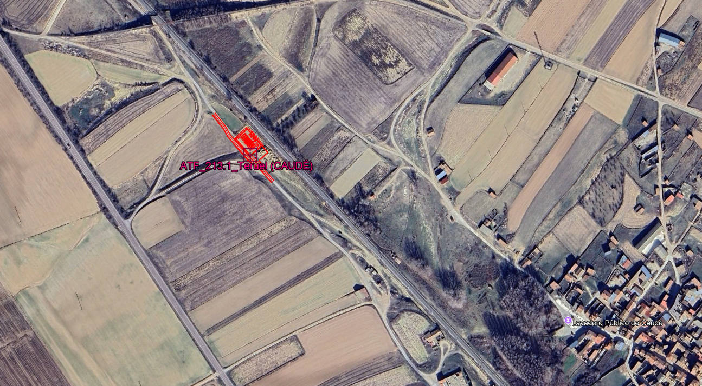
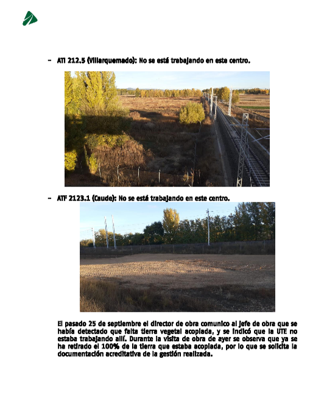

https://denuncias.policia.es/OVD/DenunciaSustraccionEnDomicilio.dgp

A la COMISARÍA DE POLICÍA NACIONAL DE TERUEL
Don Alejandro Obregón Caro con DNI nº 48824243G y domicilio a efectos de notificación en C/La Granja, nº15, Portal B, Planta 2, Puerta 3, 28108 ALCOBENDAS, actuando en nombre y representación de UTE SSEE ZARAGOZA TERUEL, con el NIF U56902562 ante la Policía Nacional comparece y, como mejor proceda en Derecho, DICE: 
Que por medio del presente escrito viene a formular DENUNCIA por un presunto delito de HURTO, tipificado en el artículo 234 del Código Penal[^1]

La presente denuncia se basa en los siguientes:
HECHOS

## PRIMERO. 
En el Punto Kilométrico (PK) 132 +050, margen derecha sentido Cella, de la N-234 en el TM de Caudé, dentro del paraje de la Rambla Marcellán, coordenadas  40°24'51.82"N, 1°12'3.98"O. Se ubica una excavación para la construcción de una subestación, parte de la electrificación del ffcc Zaragoza-Valencia, sin actividad desde agosto de 2024 por modificado de proyecto pendiente. Se adjunta imagen:

## SEGUNDO. 
Que el 25 de septiembre de 2025 La Sra. Directora Ambiental (DAO) de ADIF comunicó de forma verbal a la Dirección de Obra (DO) de INECO del proyecto ADIF PARA LA EJECUCIÓN DE LAS OBRAS DE LAS SUBESTACIONES ELÉCTRICAS DE TRACCIÓN DE CARIÑENA Y VILLAFRANCA, CENTROS DE  AUTOTRANSFORMACIÓN Y LÍNEA AÉREA DE ALTA TENSIÓN PARA EL TRAMO ZARAGOZA – TERUEL DEL CORREDOR CANTÁBRICO – MEDITERRÁNEO, con Resolución de 2 de noviembre de 2010 y Resolución de 6 de septiembre de 2002 de las DIAs sucesivas y núm expediente 3.23/06110.0120, y este a su vez a mí, la falta de tierras vegetales en la ubicación antedicha. 

## TERCERO.
El 22 de octubre del coriente, la misma Directora comunicó, vía informe, la desaparición de la totalidad de las tierras existentes.

## CUARTO
Las tierras procedentes de la excavación ascendían a un total de `XXXX m3` y se había acopiado para extendido posterior, así como reutilización. Por tanto, hay que reponerlas previos análisis de idoneidad y aprobaciones posteriores.

## QUINTO 
Como prueba de los hechos, además de la página del informe de DAO, adjunta como elemento de prueba, se incluyen las siguientes:

SOLICITA que, teniendo por presentado este escrito junto con sus copias y documentos adjuntos, se sirva admitir la presente Denuncia y acuerde la práctica de las diligencias necesarias para la averiguación y comprobación de los hechos, y en su caso, la identificación y enjuiciamiento de los responsables. 
Es justicia que se solicita en Teruel, a 10 de diciembre de 2025.

Firma

[^1]:Ley Orgánica 10/1995, de 23 de noviembre, del Código Penal. BOE núm. 281, de 24/11/1995.
BOE-A-1995-25444